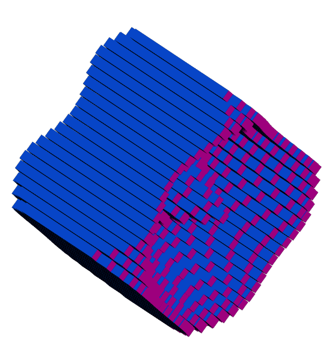
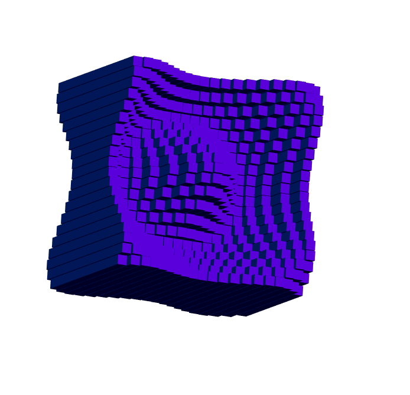
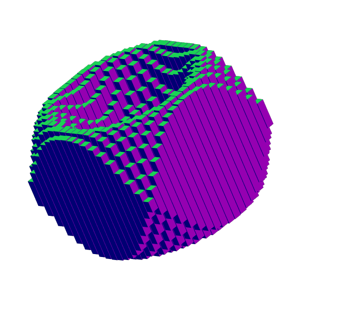

# Cube Wave

## Deployment Link

https://dj-viking.github.io/cube-wave/

## Description
- Using p5.js library, followed Coding Train in his video of creating the cube wave animation. 
- Tried to make the animation different from what he had.
- Kept a lot of the same parameters and commented some out for later.

## Screenshots

